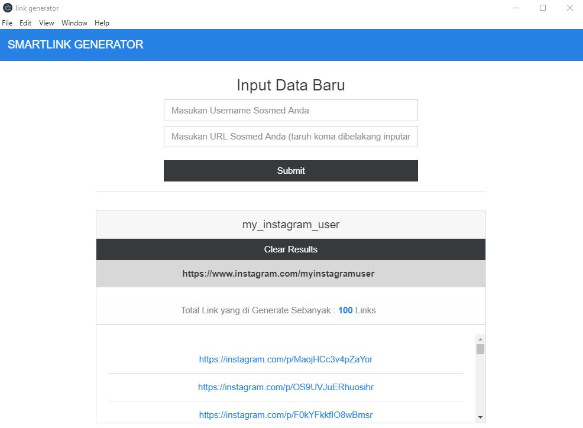
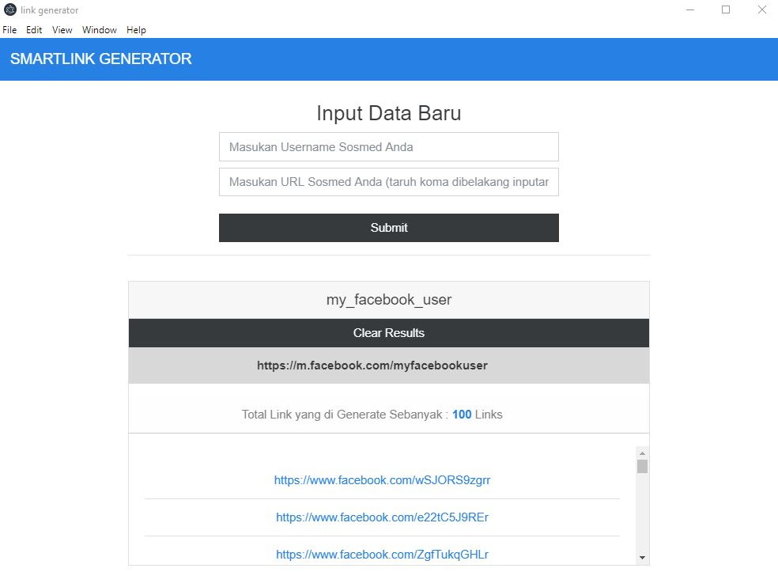
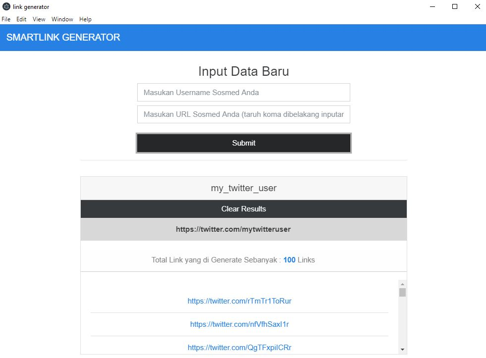

## SMARTLINK GENERATOR

### About ElectronReact Duplicate String

SMARTLINK GENERATOR is an Application which is use to Generate 100 Fake Link for Social Media Input Link on textbox
and save it into Firebase, Link like facebook, Twitter or Insagram could be automatically generate.
This Application was developed using React combine with Electron and Firebase.

### Getting Started

To getting start with this Application, simply clone this repository by running this command below

```
    git clone https://github.com/ivandi1980/electron-react.git
```

or you can directly download the zip file by clicking the download button on the top right side of this repository.

### Installation

After you clone or download this repository, just run this command below

```
yarn install
```

wait until the installation finish, and then type this command below to run the program

### Run the Project

```
yarn start
```

This command will run on developement mode.
After all completed, you can playaround with those code.
You can refactor the code, change, adding some new feature as you want.

### Build the project

After you refactor or change any code on this Project, just do this command to Build it

```
yarn build
```

### ScreenShoot


#### Facebook Result



#### Facebook Result



#### Facebook Result


